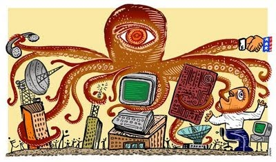
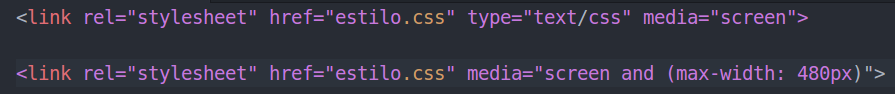
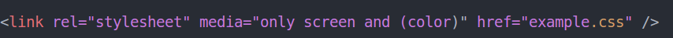

# Media queries

## Motivção:

* Portabilidade HTML;
* Diversos dispositívos.

### Tipos de midias

* all
* braille
* embossed
* handheld
* print
* projection
* screen
* speech
* tty
* tv

## PROBLEMA E SOLUÇÃO

### Caracteristicas dos dispositivos

* width
* height
* device-width
* device-height
* orientation
  <pre>
    <code>
    @media only screen and (orientation: landscape) {
  body {
      background-color: lightblue;
    }
}
    </code>
  </pre>
* aspect-ratio
* device-aspect-ratio
* color
* color-index
* monochrome
* resolution
* scan
* grid

## Operadores lógicos.

Você pode compor media queries complexos usando operadores lógicos, incluindo not, and, e only.

### and

A palavra-chave and é usada para combinar múltiplas media features, bem como combinar media features com media types. Uma media query básica, uma media feature simples com a media type all, pode parecer com isso:

<pre>
  <code>
    @media (min-width: 700px) { ... }
  </code>
</pre>

Se, no entanto, você desejar que isso se aplique apenas para telas em landscape, você pode usar o operador and para deixar todas as media features juntas.

<pre>
  <code>
    @media (min-width: 700px) and (orientation: landscape) { ... }
  </code>
</pre>

### Listas separadas por vírgula

Listas separadas por vírgulas comportam-se como o operador or quando utilizadas em media queries. Quando utilizamos media queries com uma lista separada por vírgulas, se qualquer media queries retornar verdadeiro, os estilos ou folhas de estilos serão aplicadas. Cada media query em um lista separa por vírgulas é tratada como uma query individual, e qualquer operador aplica em uma media query não afeta os outros. Isto significa que media queries separadas por vírgulas podem ter objetivos diferentes de media features, types e states.

<pre>
  <code>
    @media (min-width: 700px), handheld and (orientation: landscape) { ... }
  </code>
</pre>

### not

<pre>
  <code>
    @media not all and (monochrome) { ... }

    /*Leitura dessa forma */

    @media not (all and (monochrome)) { ... }

  </code>
</pre>

### only

A palavra chave only previne que navegadores antigos que não suportam media queries com media features de aplicar os estilos dados:

