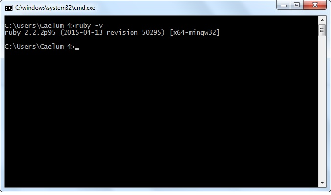

# Sass

 Sass é um pré-processador super podereso de css tem como objetivo tornar a escrita do css menos sofrível. Quer Saber como?

## Instalação
 Para instalar o Sass você deverá escolher o sistema operacional e seguir os passos seguintes.

### Linux
Se estiver usando linux deverá inicialmente instalar o Ruby.
Após o Ruby instalado usar o seu gerenciador de pacotes _gem_ para instalar o Sass:

<pre>
  <code>
    sudo su -c "gem install sass"
  </code>
</pre>

### Windows

1. Faço download [Ruby Instaler](http://rubyinstaller.org/downloads) de acordo com sua versão  

2. Certifique-se que foi instalado com sucesso verificando qual sua versão
<pre>
<code>ruby -v</code>
</pre>

3.  Com o prompt ainda aberto instale o Sass
<pre>
  <code>
    gem install sass
  </code>
</pre>

4. Verifique se o Sass foi instalado.
<pre>
  <code>
    sass -v
  </code>
</pre>
### Mac

Use o gerenciado de pacotes ruby para instalar o sass.

<pre>
  <code>
    gem install sass
  </code>
</pre>
Depois verifique sua versão
<pre>
  <code>
    sass -v
  </code>
</pre>

## Conteúdo

O conteúdo será divido em 8 etapas:

* Preprocessing
* Variables
* Nesting
* Partials
* Import
* Mixins
* Inheritance
* Operators

###  Pré-processadores

* Facilitar a escrita e compreensão do css.
* Legibilidade do código
* Reuso
* etc, etc, etc ...
Para escutar a conversão de um arquivo *sass* para *css* usamos o comando:
<pre>
<code>
sass input.scss output.css

</code>
</pre>
Para escutar um diretório:
<pre>
<code>
sass --watch app/sass:public/stylesheets
</code>
</pre>

O Sass possui duas sintaxe: SCSS, SASS.
## variáveis:
A possibilidade de armazenar informações que você irá reutilizar. Para isso utiliizar o <code> $ </code> para criar uma variável.

* SASS:
<pre>
  <code>
  $font-stack:    Helvetica, sans-serif
$primary-color: #333
 body
   font: 100% $font-stack
   color: $primary-color

  </code>
</pre>

* SCSS:
<pre>
  <code>
  $font-stack:    Helvetica, sans-serif;
$primary-color: #333;
body {
    font: 100% $font-stack;
    color: $primary-color;
}
  </code>
</pre>

Quando processado o Sass levará os valores amarzenados nas variáveis para as propriedades em css.

<pre>
  <code>
  body {
    font: 100% Helvetica, sans-serif;
    color: #333;
}
  </code>
</pre>

## Aninhamento

Quando escrevemos html definimos hieraquia dos elementos pelo seu posicionamento dentro do nó.  
Em Sass escrevemos da mesma forma. O aninhamento, ou indentação irá definir além de uma hierarquia visual, a estrutura qualificada denotando um boa prática de escrita css.

<pre>
  <code>
  nav
ul
  margin :  0
  padding :  0
  list-style :  none

li
  display :  inline-block

a
  display :  block
  padding :  6px  12px
  text-decoration :  none
  </code>
</pre>

### Partials - Importação

O Css possui propriedade de importação através para palavra-chave <code> @Import  </code> para que possamos escrever nosso códigos em partes menores e mais substanciais.

Porém quando importamos um arquivo css ele abre uma nova requisição _HTTP_  
*Sass* importa o arquivo css, porém dentro da requisição atual. Criando um único arquivo css para o seu navegador.

> Imagine que temos dois arquivos <code> _reset.sass e base.sass </code> queremos importar reset em base
<pre>
  <code>
  // _reset.sass
html,
body,
ul,
ol
  margin:  0
  padding: 0
  </code>
</pre>
<pre>
  <code>
  // base.sass
@import reset
body
  font: 100% Helvetica, sans-serif
  background-color: #efefef
  </code>
</pre>

Resultado:  
<pre>
  <code>
  html, body, ul, ol {
  margin: 0;
  padding: 0;
}
body {
  font: 100% Helvetica, sans-serif;
  background-color: #efefef;
}
  </code>
</pre>

### Mixins

Algumas vezes nos pegamos no trabalho tedioso que é a reescrita de código css, como exemplo a seleção de motores de rendezição.   Para poupar trabalho, podemos usar mo Mixins

<pre>
  <code>
  =border-radius($radius)
  -webkit-border-radius: $radius
  -moz-border-radius:    $radius
  -ms-border-radius:     $radius
  border-radius:         $radius

.box
  +border-radius(10px)

  </code>
</pre>

### Extend/Inheritance - Herança

Uma vez o código escrito podemos reusar os propeirades de um seletor para outro usando a palavra-chave <code>  @extend  </code>

<pre>
  <code>
  .message
border: 1px solid #ccc
padding: 10px
color: #333

.success
@extend .message
border-color: green

.error
@extend .message
border-color: red

.warning
@extend .message
border-color: yellow
  </code>
</pre>
Resultado :
<pre>
  <code>
  .message, .success, .error, .warning {
border: 1px solid #cccccc;
padding: 10px;
color: #333;
}
.success {
border-color: green;
}
.error {
border-color: red;
}
.warning {
border-color: yellow;
}
  </code>
</pre>

### Operators - Operadores Matemáticos.

Operações matemáticas mpodem ser muito úteis em css.
O Sass traz essa solução com operadores artiméticos <code>
  + (+) soma,   
  - (-) subtracao,  
  * (*) multiplicação,   
  * (/) divisão   
  * (%) mod uo resto da divisão.  
</code>

<pre>
  <code>
  .container
  width: 100%
article[role="main"]
  float: left
  width: 600px / 960px * 100%
aside[role="complementary"]
  float: right
  width: 300px / 960px * 100%
  </code>
</pre>
Resultado:
<pre>
  <code>
  .container {
  width: 100%;
}
article[role="main"] {
  float: left;
  width: 62.5%;
}
aside[role="complementary"] {
  float: right;
  width: 31.25%;
}
  </code>
</pre>
## Links úteis

* [__Sass__](http://sass-lang.com/)
* [__Sass Github__](https://github.com/sass/sass)
* [__The Sass Way__](http://thesassway.com/)
