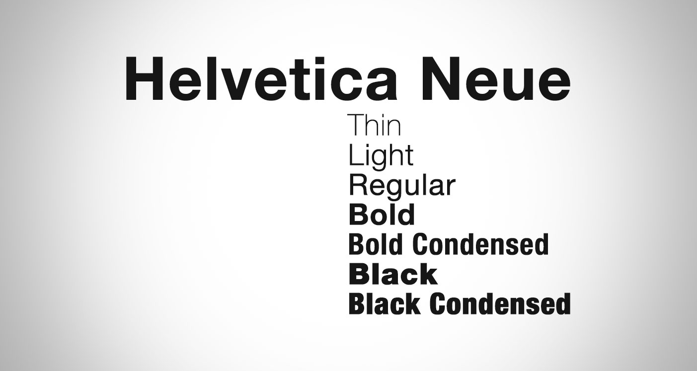
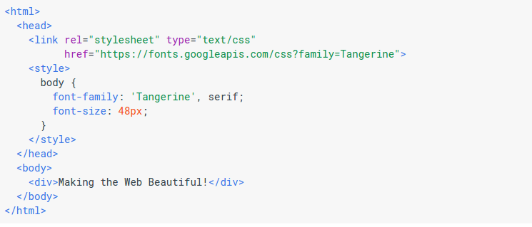

# WEB FONTS

* Permite usar fonts não instaladas;
* Download Automático se necessário.

## Formatos de fontes permitidos:

* TrueType Fonts (TTF)
* OpenType Fonts (OTF)
* The Web Open Font Format (WOFF)
* The Web Open Font Format (WOFF 2.0)
* SVG Fonts/Shapes
* Embedded OpenType Fonts (EOT)

## USO:
<pre>
  <code>
  @font-face {
   font-family: helveticaneue;
   src: url('HelveticaNeueLTStd-UltLt.otf');
}
  </code>
</pre>

<pre>
  <code>
  p {
  font:36px helveticaneue, Arial, Tahoma, Sans-serif;
}
  </code>
</pre>

### Download Automático se necessário:

* Download automático se necessário:

  <pre>
    <code>
    @font-face {
     font-family: helveticaneue;
     src: local(HelveticaNeueLTStd-UltLt.otf), url(HelveticaNeueLTStd-UltLt.otf);
  }
    </code>
  </pre>

*  Palavra reservada __local__ prioriza a busca no computador do cliente.

## Diretório de fonts na web
* http://www.cssfontstack.com/Web-Fonts
* https://www.google.com/fonts

<pre>
<code>

body {
  font-family: 'Tangerine', serif;
  font-size: 48px;
  text-shadow: 4px 4px 4px #aaa;
}
</code>
</pre>

